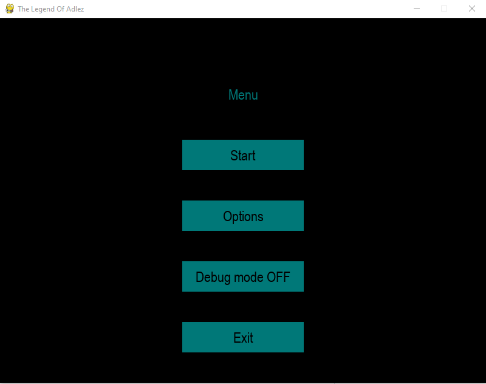
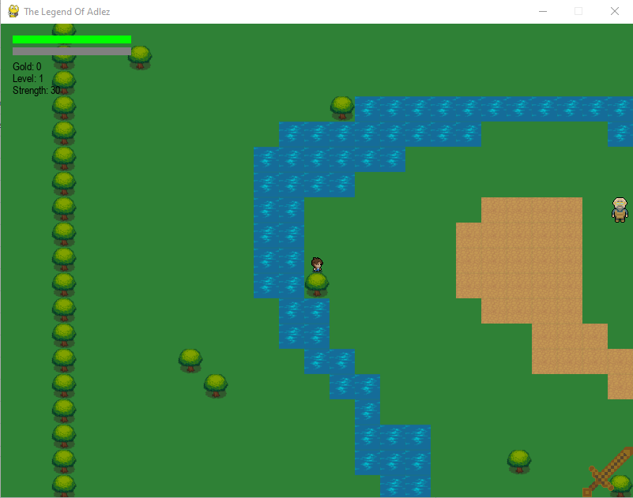
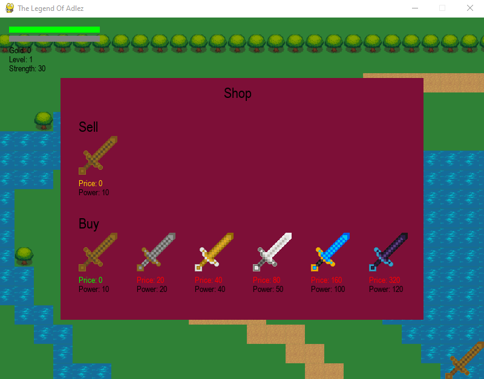
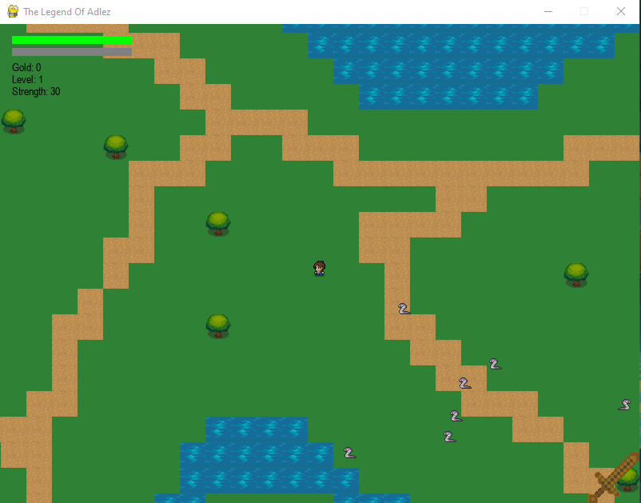
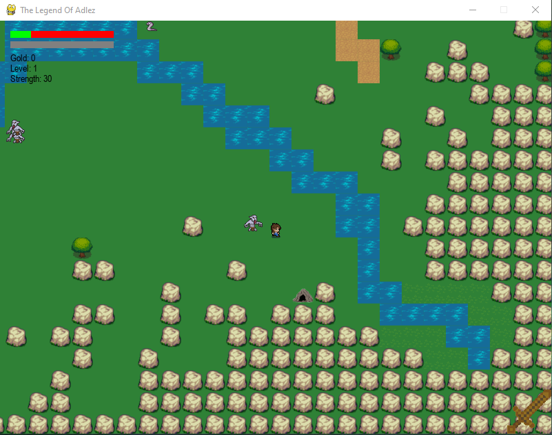

# TheLegendOfAdlez
Python course at AGH UST.

# Graphics: 
Vecteezy.com

# Versions:
pygame==2.1.2

# Summary:
## Description:
The game is a project for python course.
It's a rpg and adventure game where we control a hero who 
must defeat enemies. This game includes only one chapter.

Main menu has a few buttons that manage the game.

There is only one map with:
- *starting point*

- *shop*

- *enemies*

- *end*

